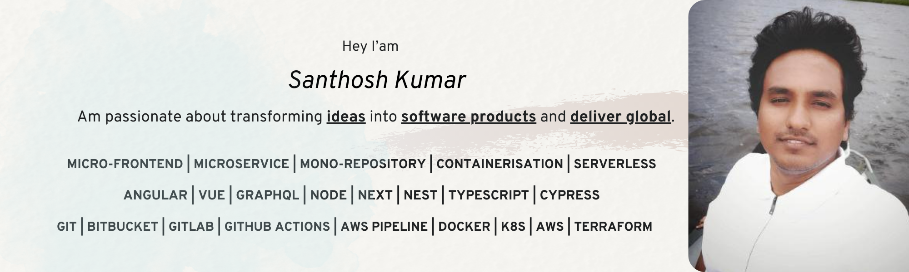

I am a passionate software engineer with a decade of experience in all aspects of the software development. My practical experience includes Design, Build, Test and Release software product. I provide prompt solutions for Digital Customer Experience Platform following Domain-Driven Design, Micro-Frontend Architecture, Micro-Service, Mono-repository, Containerisation & Server-less patterns. Practising Agile at Work.

- NX Workspace, Mono-repository
- Angular 11, Vuejs, Reactjs, NGRX, VueX, Apollo GraphQL, Storybook, styled-components
- Node, Express, Nest, Nextjs
- Javascript, Typescript, Jest, RxJs
- GIT, Bitbucket
- Bamboo, Github Actions, Jenkins, AWS Code Build
- Docker, Kubernetes (EKS ), AWS Lambda, API Gateway, Route 53, WAF, Web Security, S3

 

  
  

